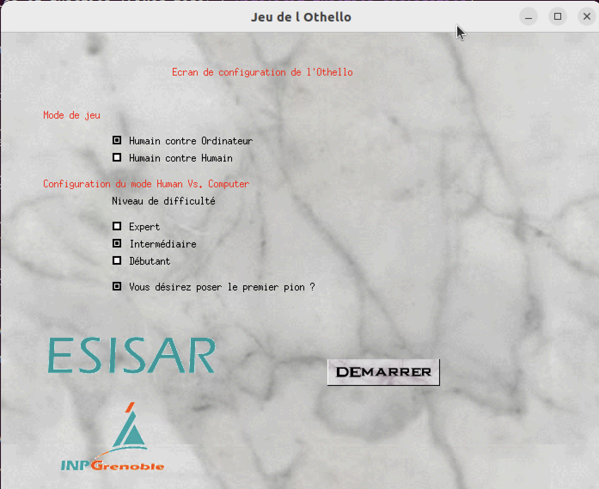
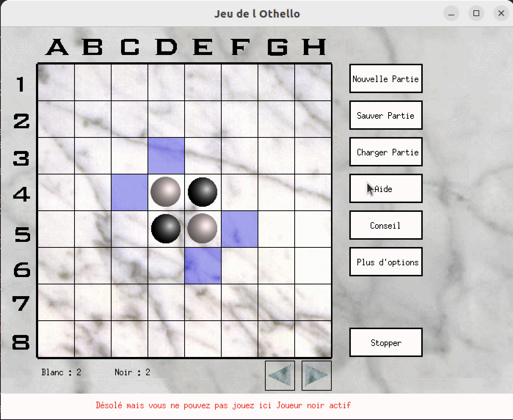

# othello
Othello, the legendary 19/20 project

# Extraction

Original found at

```
D:/Sauvegardes/Archives/Esisar/Annee 2001-2002 EI2/Mini-Projet/Othello/Version final
```

# Build

```
make clean
make
```

# Notes

This is exactly the code one would expect from a 2001 engineering student project in their first C exercice.

# Screenshots



